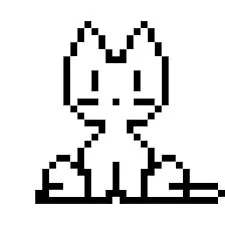

# oneko.js



Original author: Ariana @ https://adryd.com, https://github.com/adryd325/oneko.js

This is a simple script that adds a cat that follows your mouse pointer around the screen. 
It's a port of the original [Neko](https://en.wikipedia.org/wiki/Neko_(software)) application 
first written in the 1980s for NEC PC-9801. This fork allows you to click on the cat to 
pause it (it can still sleep and scratch itself or its surroundings, though).

Usage: include
```HTML
  <script id="onekoData" type="application/json">
    {
      "onekoGIF": "/path/to/oneko.gif"
    }
  </script>
  <script src="/path/to/oneko.js"></script>
```
in your HTML code.

Brief history of Neko: https://eliotakira.com/neko/
